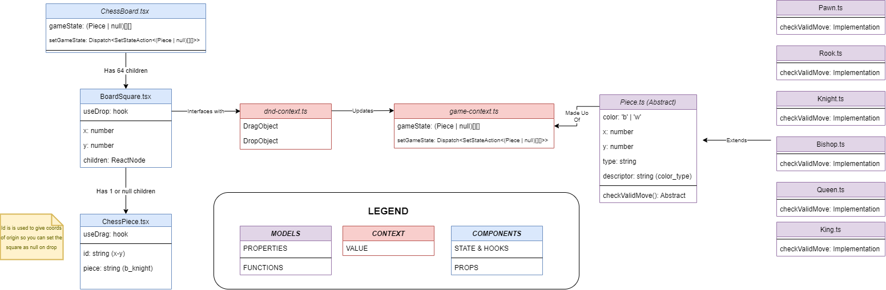

# Progress

- [x] Draw a board
- [x] Add chess pieces to the board
- [x] Add drag and drop
- [ ] Add valid move logic (includes en puissant, excludes castling)
- [ ] Add validation for when King might be in check
- [ ] Add castling functionality
- [ ] Add stalemate check
- [ ] Add a second initial game state where the player is black
- [ ] Add socket.io to enable chat based communication and movement communication
- [ ] Add a timer

# Assumptions and Assertions

- The board is always facing the current user, and there is no view switching (you can't flip the board to see what your opponent sees). This enables rule checking to be consistent.
- You don't need to handle rule checking the opponent's moves, assume that everyone is a good actor as this isn't a ranked system with matchmaking. 

# Instructions to Run

This project was built using create-react-app --template typescript
Run `npm run start` to begin the application.

# Design

# Note on design

Originally I wanted to use functional programming to move child components around to different parent components (pieces
and squares) instead of using state management and re-rendering of the board on each move. I quickly realized that memo
and portals were not what I had originally thought they were, and were not suitable for this and what I was doing was
likely against the spirit of React. There is an open source project which hacks React to enable
re-parenting  (https://dev.to/paolimi/reparenting-is-now-possible-with-react-3ci0) however it is unstable. I ended up going with the design above after exploring this.

